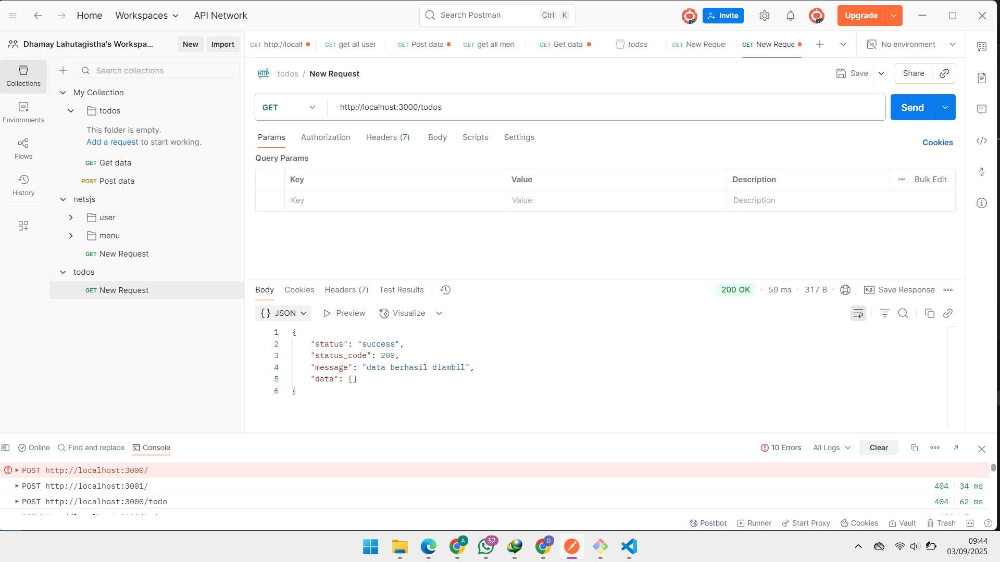
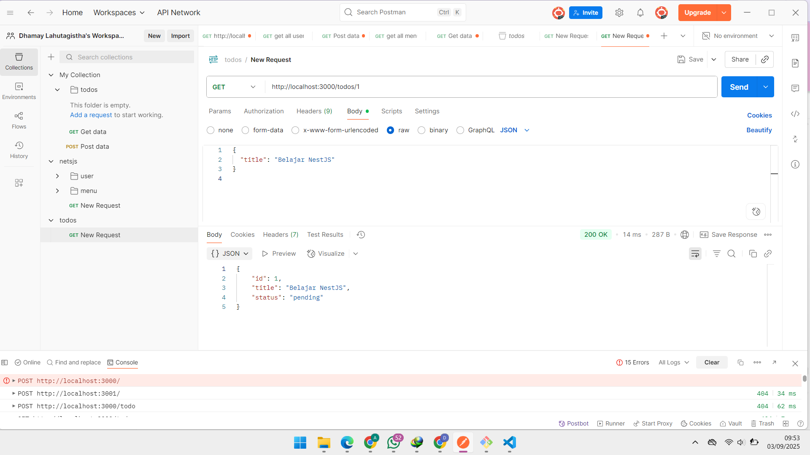
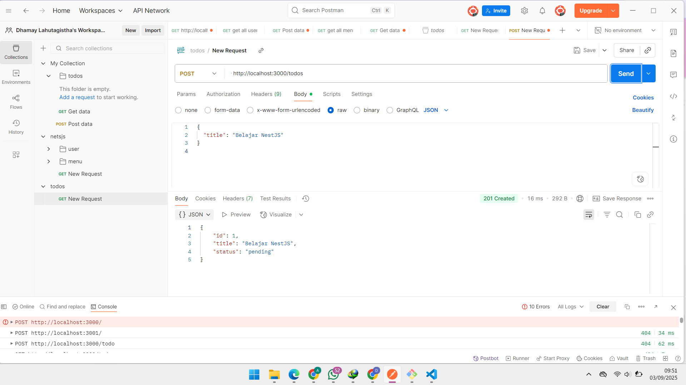
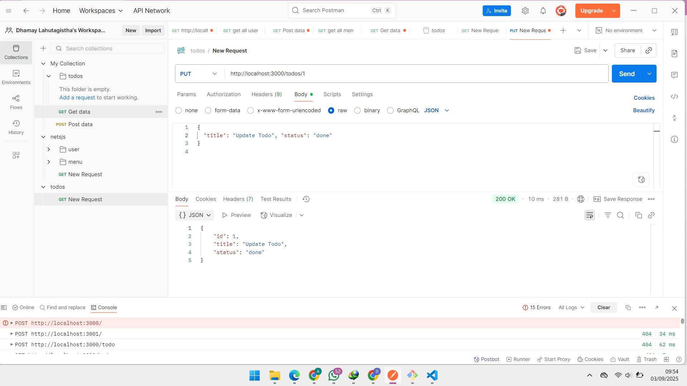
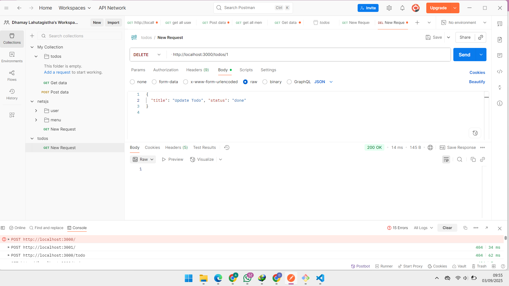

# 🚀 NestJS API Project

# 1. Identitas
- **Nama** : Dhamay Lahutagistha Pramu Putri  
- **Kelas** : XI RPL 1

# 2. Deskripsi
API sederhana untuk mengelola todo list menggunakan NetJS.
API ini memiliki fitur Create, Read, Update, dan Delete data todo, 

## Daftar Endpoint

| Method | URL                      | Body (JSON)                                   | Deskripsi                        |
|--------|--------------------------|----------------------------------------------|---------------------------------|
| GET    | http://localhost:3000/todos       | -                                            | Menampilkan semua todo           |
| GET    | http://localhost:3000/todos/:id   | -                                            | Menampilkan todo berdasarkan ID  |
| POST   | http://localhost:3000/todos       | { "title": "Belajar API", "status": "pending" } | Menambah todo baru               |
| PUT    | http://localhost:3000/todos/:id   | { "title": "Update Todo", "status": "done" }    | Memperbarui todo berdasarkan ID |
| DELETE | http://localhost:3000/todos/:id   | -                                            | Menghapus todo berdasarkan ID    |

# Screenshot Hasil Uji Coba API di Postman

### 📌 Contoh: GET `/api/items`

### 📌 Contoh: GETBYID `/api/items/id`

### 📌 Contoh: POST `/api/items`

### 📌 Contoh: PUT `/api/items/:id`

### 📌 Contoh: DELETE `/api/items/:id`

